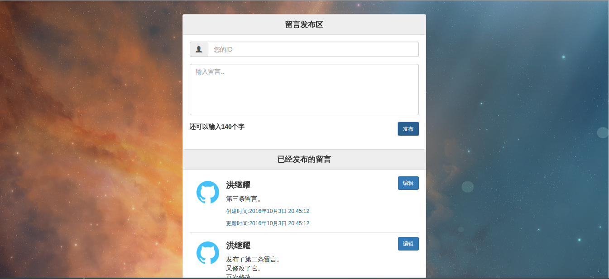
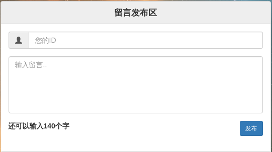
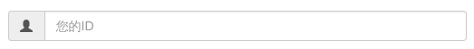
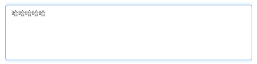
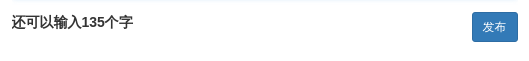
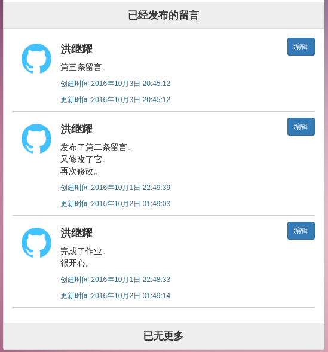
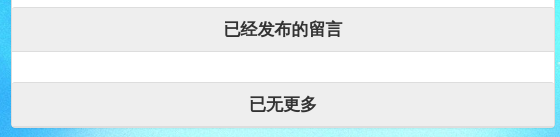
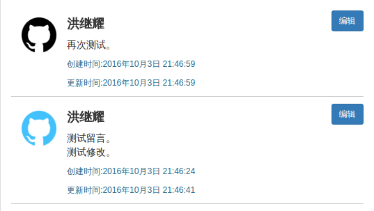
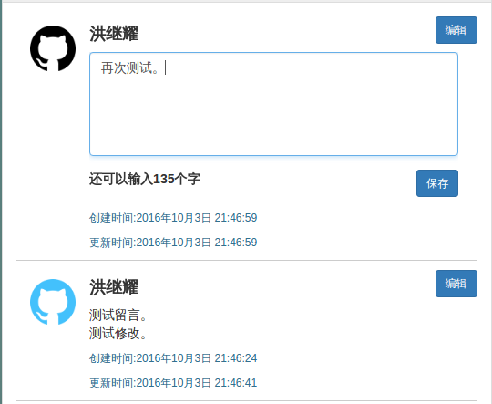

## 布局说明

### 总体布局说明
1. 页面是**响应式设计**，可以适应多终端。
2. 页面具有**动态的背景图**，并且背景图**平滑切换**。
3. 网站**有一个小icon**，这里采用vue的icon，不自行制作。
4. 网站核心部分是一个居中的面板。

### 总体效果图


### 留言发布区设计说明

#### 效果图

  

#### 代码 
+ 首先留言发布区用了`bootstrap`的面板组件。其代码如下:（为了更清晰，简化过，只留下与界面设计有关的部分）

```html
<div class="panel-heading">留言发布区</div>
<div class="panel-body">
	<form class="form-group">
		<div class="input-group">
			<span class="input-group-addon">
				<span class="glyphicon glyphicon-user"></span>
			</span>
			<input type="text" placeholder="您的ID" class="form-control">
		</div>
		<textarea  spellcheck="false"  type="text" placeholder="输入留言.." class="form-control comment"  rows="5"></textarea>
		<span class="text-num-limit">还可以输入{{textNumLimit}}个字</span>
		<button type="submit" class="btn btn-sm btn-primary send-btn">发布</button>
	</form>
</div>
```
#### 设计说明

+ 头部是由`.panel-heading`修饰的面板头，内容区是`.panel-body`修饰的面板内容区，面板头用css重新修饰过背景颜色和字的位置

```css

.panel-heading {
	text-align: center;
	border-top: 1px solid transparent;
	font-size: 1.2em;
	font-weight: bold;
	background-color: #eee !important;
}

```

+ 面板内容区用了`bootstrap`的表单组件，所有的组件都被`form-control`修饰，具有宽度100%的属性，从而实现响应式。  

+ 首先是`.input-group`修饰的输入框组，由`input-group-addon`包裹的icon和一个input输入框组成。



+ 接下来是一个`textarea`，它用`spellcheck="false"`取消了拼写检查，用`rows="5"`规定了有五行高，用`word-break: break-all`去掉了整词换行，用`resize: none;`去掉了右下角的改变大小的控件。



+ 再接下来是用于显示计数的文字，和一个用`btn btn-sm btn-primary`分别修饰了形状大小颜色的按钮，他们在同一行。文字左浮动，按钮右浮动。  




### 留言查看区设计说明

#### 效果图



#### 代码

+ 依旧是一个面板组件，代码如下:（为了更清晰，简化过，只留下与界面设计有关的部分）

```html
<div class="panel-heading">已经发布的留言</div>
<div class="panel-body">
	<div class="msg-box" transition="item">
		
		<div class="text-box">
			<h4 class="user-name"><strong>{{msg.userId}}</strong></h4>
			<button class="btn btn-sm btn-primary edit-btn" @click="editComment($index)">编辑</button>
			<p class="user-comment">{{{msg.comment}}}</p>
			<form  class="form-group">
				<textarea  spellcheck="false"  type="text" placeholder="输入留言.." class="form-control comment" v-model="msg.comment" rows="5"></textarea>
				<span class="text-num-limit">还可以输入{{msg.textNumLimit}}个字</span>
				<button type="submit" class="btn btn-sm btn-primary send-btn">保存</button>
			</form>
			<p class="pull-left small text-info date">创建时间:{{msg.date}}</p>
			<p class="pull-left small text-info date">更新时间:{{msg.updateDate}}</p>
		</div>
	</div>
</div>
<div class="panel-heading">已无更多</div>
```

```css

.msg-box {
  overflow: hidden;
  border-bottom: 1px solid #CCC;
  margin-bottom: 10px;
  position: relative;
  .edit-btn {
    position: absolute;
    top: 0px;
    right: 0px;
  }
  .head-img {
    float: left;
    width: 10%;
    margin: 10px 15px;
  }
  .text-box {
    float: left;
    width: 80%;
    word-break: break-all;
  }
  .date {
    width: 100%;
  }
}

```

#### 设计说明

+ 首先整个区域被两个`panel-heading`的块包住。



+ 非编辑状态下，留言盒子部分左侧是一张左浮动的用`.head-img`修饰的头像，占10%。右侧是文字区域，由一个`h4`标签做ID显示，一个`p`标签做留言显示，两个一个`p`标签做时间显示，还有右上的用绝对定位定死的编辑按钮。每个盒子还有1px下边框做分割线。



+ 编辑状态下，用作展示留言的`p`标签消失，变成一个`textarea`，该区域几乎是上边发布区的翻版，故不加赘述。



+ 编辑按钮与发布区的提交按钮一致，不加赘述。

+ 时间部分有`pull-left small text-info`这三个`bootstrap`全局样式修饰，分别修饰位置，大小和颜色。

### 其他

#### 说明

+ 动画效果由`css3`和`js`共同控制。`css3`主要实现过渡效果，而`js`主要修饰变化效果，还使用了`vue`提供的`vue-animated-list`插件，为留言的插入提供了动画效果。

#### 代码

**控制背景变换的过渡效果**  

```css
body {
  transition: all 1s ease;
}
```

**控制留言插入效果**  

```html
<div v-for="msg in msgs" transition="item">
<script src="/javascripts/libs/vue-animated-list.js"></script>
```
```css
.item-move {
  transition: transform .5s cubic-bezier(.55, 0, .1, 1);
}
```